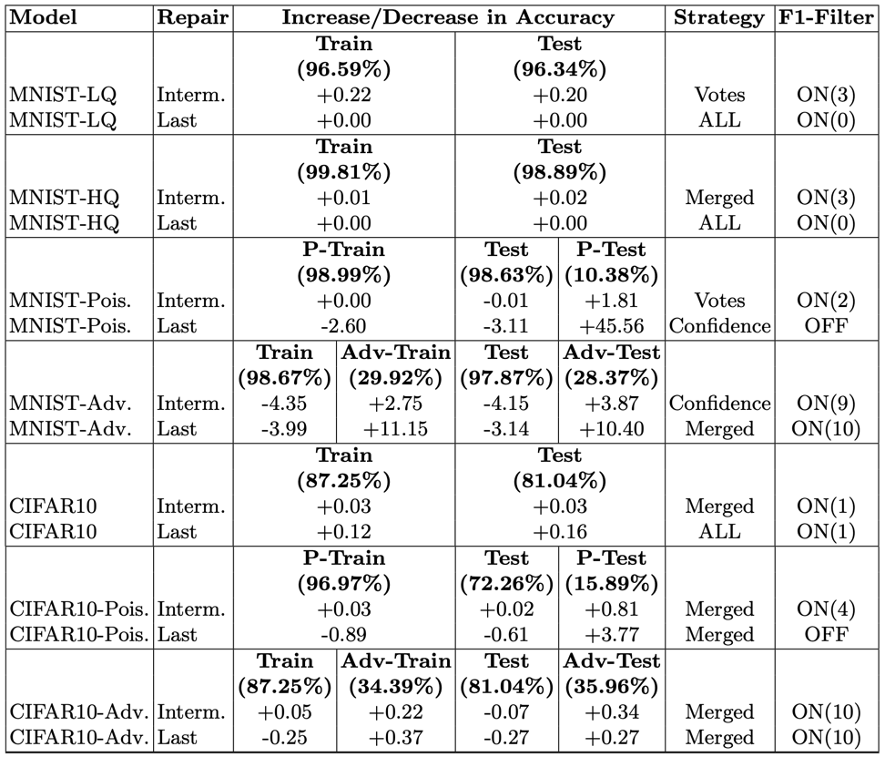
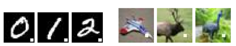

# Benchmark 
Model list for checking performance 

[//]: # (NNrepair, Survey)
**Table 1.** Summary of NNrepair performance on all models

NNrepair can improve the accuracy by
45.56 percentage points on poisoned data and 10.40 percentage points
on adversarial data. NNrepair also provides small improvement in the
overall accuracy of models, without requiring new data or re-training

- MNIST
  - LQ(7 Layers) 
  - HQ(10 Layers)
  - Poisoned data (Backdoor attack)
  
  - Adversarial data (Adversarial algorithm)
- CIFAR-10 
  - Poisoned data
  - Adversarial data
  
- CNN
- ResNet
  - 18
  - 50
  - 152
- BERT-Small
- BERT-Large
- Gemini

# 
